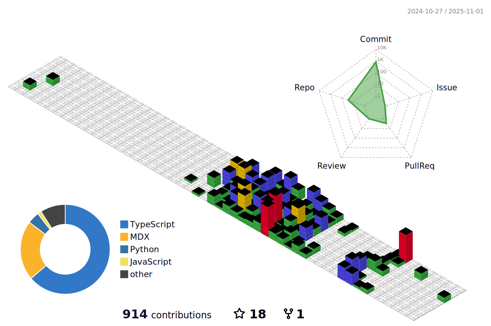

<h1 align="center">Hello 👋🏻, I'm Shivam M. Salunkhe aka SMS.</h1>
<h3 align="center">AI Enthusiast, Prompt Engineer, 3D CGi & VFX Artist.</h3>

  

- 🔭 I’m currently working on [AI Agent & MCP Project](https://github.com/sms03/ytch-mcp) [and also UE5 Project.]

- 🌱 I’m currently learning **Astro, Nuxt, Unreal Engine, LLMS, MCP servers and AI Agents.**

- 👨‍💻 All of my projects are available at [https://www.behance.net/SMSXART | https://github.com/sms03]

- 💬 Ask me about **Python, React, Cinema4D, Blender, Octane, AI, ML and DL.**

- 📫 How to reach me **shivamsal2000@gmail.com**

- 📄 Know about my experiences [https://smsx.netlify.app/](https://smsx.netlify.app/)

- ⚡ Fun fact **AI will not replace us HUMANS!**

## 📲 Connect with me:

## 💻 Tech Stack:

  
  
  
  
  
  
  
  
  
  
  
  
  
  
  
  
  
  
  
  
  
  
  
  
  
  
  
  
  
  
  
  
  
  
  
  
  
  
  
  
  
  
  
  
  
  
  
  
  
  
  
  
  
  
  

###

<picture>
  <source media="(prefers-color-scheme: dark)" srcset="https://raw.githubusercontent.com/sms03/sms03/output/pacman-contribution-graph-dark.svg">
  <source media="(prefers-color-scheme: light)" srcset="https://raw.githubusercontent.com/sms03/sms03/output/pacman-contribution-graph.svg">
  
</picture>

###

###

###

## 📊 GitHub Stats:

### ✍🏻 Quote

